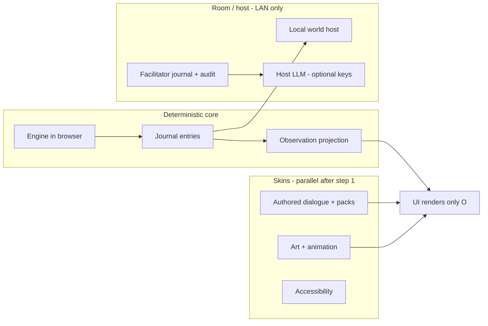

# Seminar delivery roadmap — from headless spine to convincing room

_Planning document, 2026-09-20. Cross-links the shipped harness and narrative ports to
the human seminar goal. **Authoritative sequencing** remains
[ADR 0079 — Three trials before anyone loves it](adr/0079-three-trials-before-anyone-loves-it.md);
this doc expands that ADR with text, graphics, facilitator products, tooling, and
pre-human LLM seminar QA._

---

## Assertion (grounded in tree)

The repository has the **substance** for rewarding, stable headless play: psychology,
calibration sweeps, exploit-tier gaming checks, the decision journal seam
(`sim/journal.ts`), authored narrative (`src/narrative/`), player commendations, and
seminar harness slices. What it lacks for leadership seminars is mostly **presentation,
evidence plumbing, and room-scale product** — the gap ADR 0079 names explicitly.

| Gap | Authoritative status |
|-----|----------------------|
| Browser match ≠ harness chess | Interactive match uses a **fake** engine (`src/app/README.md`) |
| GUI not yet a journal writer | D219 ruled; relationship inspector still leaks past `Observation` |
| Model players / containment | Journal decorator exists; model agents and computed envelope do not |
| Facilitator dashboard & audit UI | Types and folds exist; M5b host/dashboard deferred |
| Four content packs | D223 order ruled; one theme in UI |
| Runtime LLM in shipped game | ADR 0004 — no; host-side and offline authoring only |

---

## North star

**The GUI and facilitator tools are journal writers and renderers of `Observation`.**
Everything that changes chess or psychology stays in the seeded core. Prose and pixels
are skins. LLMs sit **outside** the core as offline authors, harness stand-ins, or
host-side enrichers — never re-entering game state (ADR 0001).

See also: [ADR 0062](adr/0062-the-decision-journal-and-the-llm-player.md),
[docs/llm_integration.md](llm_integration.md), [development_plan.md](development_plan.md)
(Milestones 5b, 6, 7).

---

## Workstreams

**Serial (ADR 0079 §2):** journal-in-app + real engine → model personas + containment
sweep → pilot cohort → facilitator audit + model facilitator.

**Parallel (ADR 0079 §4):** dialogue/pack authoring, art pipeline, accessibility,
facilitator **document** templates that do not touch balance knobs.

---

## Block A — One honest browser match (ADR 0079 step 1)

**Goal:** Interactive path writes `JournalEntry`s; export `{ journal, seed, determinismId }`;
Lozza or Stockfish WASM behind the same barrier as harness; `ui/` reads only
observation-shaped inputs; leak test in CI.

| Session focus | Deliverable |
|---------------|-------------|
| Journal writer from app match loop | Contract parity with `sim/journal.ts` |
| Engine worker | `determinismId` matches `pnpm sim` on same seed |
| D219 leak fix | No `ui/` import of raw `PieceState` for player-facing truth |

**Exit:** One browser match replay-verifiable against harness on the same seed.

---

## Block B — Text that scales (Milestone 6)

**Goal:** Routine exchanges are **committed data**, not runtime prompts.

1. **Situation matrix expansion** — desertion, refusal, override, quiet-quit, witness
   first ([llm_integration.md](llm_integration.md) §2 priority). CI coverage on reachable
   role-abstract keys (ADR 0023).
2. **Offline distillation** — matrix → (cloud LLM or local SLM) → **human-reviewed**
   JSON → `dialoguePack.json` / generated tree; `pnpm dialogue:distill` and
   `pnpm dialogue:check` as gates.
3. **Fragment composition** — grievance + target + intensity stems.
4. **Content packs (D223)** — military → medieval → corporate → classic/purist; pilot
   cohort uses **corporate**.

### Runtime vs offline LLM

| Layer | Where | Enters game state? |
|-------|--------|-------------------|
| `AuthoredProvider` | Shipped client, sync | No (strings only) |
| Cached LLM lines | Host pre-warm | No |
| Live LLM | Facilitator debrief, award blurbs, cohort narrative | No |

Shipped configuration: synchronous authored tree only (ADR 0004). Optional
`LlmProvider` decorates with timeout → silent fallback (`docs/llm_integration.md`).

**Local micro-models:** batch authoring and variant generation on developer machines
or CI — not in the player build.

---

## Block C — Model seminar (ADR 0079 step 2)

**Hard gate before seating humans.**

1. Fork machinery (ADR 0062 §5): `AgentIdentity { id, promptVersion, optionSetVersion }`.
2. Personas as versioned prompt files: honest styles, merchant (cross-check exploit
   tier), vicious, bored, disengaged (D222: near-uniform choice over legal options).
3. Sweep: same seeds as NPC coverage; containment envelope per ADR 0063.
4. **Replay analyzer v1:** journals scored for ninety-minute cliff, leak checks,
   commendation leakage, disengagement metric.

**API hooks:** implement once behind a **host-side `AgentPort`** (OpenAI, Anthropic,
Gemini, Azure OpenAI / Copilot). Keys only in facilitator environment — never in
`src/app`.

**Exit:** Every persona contained, or each escape is a named finding with fix or ruling.

---

## Block D — Surface that convinces (ADR 0079 step 3)

Depends on Block A; three tracks may run in parallel:

| Track | Deliverable |
|-------|-------------|
| **D1 Legibility** | First ninety minutes show a legible leadership event (5.8i); ADR 0018 cause panels; transcript visible (ADR 0030) |
| **D2 Variety** | Four packs as data; pack-coverage CI; same seed + agent → same journal except `agent` metadata |
| **D3 Access** | Colour-safe auras, keyboard, reduced motion (M7.3) |

---

## Block E — Graphics and identity (parallel art pipeline)

Stage ambition — avoid isometric-everything in v1:

| Stage | Player sees | Production |
|-------|-------------|------------|
| **E0** | Blueprint + event motion (refusal, desertion) | CSS / Lottie / SVG on chessground |
| **E1** | Recognizable role silhouettes | Static sprite per role + pack palette |
| **E2** | Emotion states per piece | Small frame sets per role |
| **E3** | Isometric or pseudo-3D board | After E1 reads in a projector room |

**Draft / start / end screens:** pack data + layout components; corporate pack for pilot.

**Sprite contract (for agents and art):** grid size, anchor, facing, hooks
(`onRefuse`, `onDesert`, `onOverride`). Commit reviewed PNGs + manifest JSON; generation
scripts in repo.

### Outside tools and MCPs (authoring only)

Not runtime dependencies. Useful for Cursor-driven iteration:

| Tool | Role |
|------|------|
| [PixelForge MCP](https://github.com/freema/pixelforge-mcp) | Gemini sprites, sheet split, pixel downscale |
| [FrameRonin MCP](https://github.com/GOODDAYDAY/FrameRonin-MCP) | Multi-backend generation, sheet compose/split |
| [Sprite AI MCP](https://www.sprite-ai.art/docs/mcp) | Pixel art, 8-dir, animation from IDE |
| [Aseprite MCP](https://github.com/diivi/aseprite-mcp) | Deterministic polish and export |
| Figma (+ MCP if adopted) | Screen layouts, facilitator PDFs |

**Combo:** AI rough → Aseprite polish → `public/assets/packs/<pack>/`.

Cloud agent environment may already expose SonarQube, GitHub, and AWS MCPs — use those
for CI and Batch sweeps, not in-game pixels.

---

## Block F — Facilitator and participant knowledge products

| Product | Mechanism | LLM |
|---------|-----------|-----|
| Player awards (8) | Computed at debrief — **landed** | Optional host prose from slots |
| Facilitator awards | M5b deferred | Same |
| Opening/closing scripts | Markdown or PDF in `docs/facilitator/` (to add) | No |
| Partial templates | Mustache-style `{commanderName}`, audit fields | No |
| Cohort narrative | Fold over journals + transcript | Host only |
| Certificate of completion | 5.8m replay-verifiable bundle | No |

Facilitator journal kinds (step 5): `pair`, `intervene`, `bench`, `feed`, `debrief`.
Model facilitator (D221) is **outside** ADR 0004 — host-side, judged by human audit.

---

## Block G — Room (ADR 0079 steps 4–5)

1. Local world host (5.8j) — journals over LAN only (D220 moot).
2. Pilot intensive (~12), corporate pack, human facilitator.
3. Facilitator audit (5.8k) + cohort dashboard (5.8h); then model facilitator.

**Do not build draft/purse/ransom seminar UI** until D218 opens those surfaces
(ADR 0061 chain still moving).

---

## Block H — Full LLM seminar and replay QA (pre-human deployment)

Harness product, not shipped client feature:

1. **Seminar simulator:** N model commanders × weeks; all decisions → journals.
2. **Quality rubric:** containment per persona; exploit-tier comparison; commendation
   non-domination (`sim/degeneracy.ts`); pacing cliff; dialogue coverage gaps; optional
   LLM-as-judge on **exported** transcripts only (host).
3. **Regression:** fake engine in CI; periodic cold Lozza for chess fidelity (ADR 0067/0068).

Inference budget for persona sweeps needs an owner ruling (ADR 0079 §6).

---

## Suggested next six working sessions

1. Block A — journal + real engine in browser.
2. Block B — dialogue coverage + military pack nouns.
3. Block C — persona harness + containment report (scripted agents, then one cloud model).
4. Block D1 — legibility UX (ninety-minute cliff, cause panels, transcript).
5. Block E — sprite contract + E1 role art.
6. Block F + H (lite) — facilitator export templates and seminar simulator rubric.

Blocks D and E may swap for stakeholder demos; **do not seat humans** until Block C passes.

---

## Working with Cursor on this repository

**Use existing assets:** `AGENTS.md`, `.cursorrules`, and skills (`living-chess`,
`psychology-engine`, `narrative-llm`, `balance-simulation`, `ci-test-design`,
`browser-e2e-testing`). Name the skill at session start.

**Avoid:**

- UI before journal + engine parity.
- Resolving open `D*` decisions in code without ADR or flagged knobs.
- Mixing pre/post cold-Lozza calibration evidence.
- Runtime LLM inside `src/app`.
- Mega-prompts spanning multiple ADR 0079 steps.

**Session prompt shape:**

> ADR 0079 step N only: [concrete deliverable]. Exit: [test or artifact]. Do not touch
> [out-of-scope].

**Model choice (rule of thumb):** thinking models for ADR/architecture/containment;
faster models for mechanical TS and tests; MCP-backed loops for sprite iteration.

**Branches:** `cursor/<descriptive-name>-2bc5` per cloud agent policy.

---

## Risks (named early)

- Draft economy UI blocked until ADR 0061 chain settles (D218).
- Hero isometric art is a content factory; legibility + voice + real engine may beat
  pixels for seminar ROI.
- Stockfish GPL constraint for commercial packaging — see `LICENSING.md`; Lozza for
  permissive browser/harness alignment where appropriate.

---

## References

| Doc | Role |
|-----|------|
| [ADR 0079](adr/0079-three-trials-before-anyone-loves-it.md) | Order and gates |
| [IMPLEMENTATION_STATUS.md](adr/IMPLEMENTATION_STATUS.md) | Decided vs shipped |
| [development_plan.md](development_plan.md) | M5b, 6, 7 milestones |
| [llm_integration.md](llm_integration.md) | Narration port and distillation |
| [ADR 0028](adr/0028-the-facilitator-is-a-leader-too.md) | Facilitator audit |
| [ADR 0031](adr/0031-commendations.md) | Player and facilitator awards |
| [ADR 0063](adr/0063-two-duties-coverage-and-containment.md) | Containment envelope |
